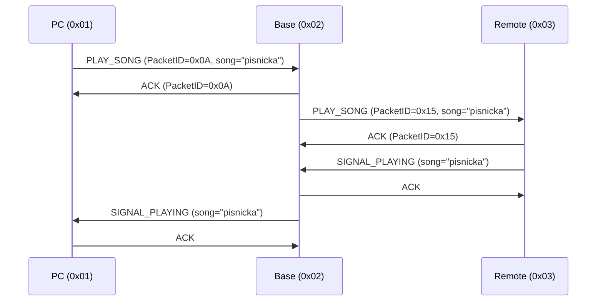

# Komunikacni protokol MIDIControl

## Prehled

Binarni komunikacni protokol pro system MIDIControl. Protokol zajistuje komunikaci mezi tremi uzly:

- **PC** -- ridici aplikace na pocitaci
- **Base** -- zakladnova jednotka (STM32G431)
- **Remote** -- vzdalena jednotka

Komunikacni cesta: `PC <-> Base <-> Remote`. PC komunikuje s Base pres USB (CDC), Base komunikuje s Remote pres Bluetooth (RN4870). Protokol pouziva ramcovou strukturu s CRC kontrolou a potvrzovanim doruceni (ACK/NAK).

---

## Adresovani

| Uzel      | Adresa |
|-----------|--------|
| PC        | `0x01` |
| Base      | `0x02` |
| Remote    | `0x03` |
| Broadcast | `0xFF` |

Broadcast zpravy jsou doruceny vsem uzlum na komunikacni ceste. Broadcast zpravy se nepotvrzuji.

---

## Escapovani (byte stuffing)

Protokol pouziva SLIP-style escapovani zakazanych bajtu. Escapovaci prefix je `ESC = 0x1B`. Nasledujici bajty jsou v datove casti zakazane a musi byt nahrazeny dvoubajtovou sekvenci:

| Zakazany bajt         | Vyznam              | Escape sekvence |
|-----------------------|---------------------|-----------------|
| `0x01` (FRAME_START / SOH) | Zacatek ramce  | `0x1B 0x21`    |
| `0x04` (FRAME_END / EOT)   | Konec ramce    | `0x1B 0x22`    |
| `0x1B` (ESC)               | Escape znak    | `0x1B 0x23`    |
| `0x24` (`$` -- RN4870 cmd) | Prikaz RN4870  | `0x1B 0x26`    |
| `0x25` (`%` -- RN4870 status) | Status RN4870 | `0x1B 0x27` |

Escapovani se aplikuje na bajty **Length** az **Checksum** (vcetne). Oddelovace ramce (`FRAME_START`, `FRAME_END`) se nikdy neescapuji.

---

## Struktura paketu

Paket pred escapovanim:

```
FRAME_START | Length | Source | Dest | PacketID | MsgType | Payload[0..N] | Checksum | FRAME_END
```

| Pole        | Velikost | Popis                                                        |
|-------------|----------|--------------------------------------------------------------|
| FRAME_START | 1 B      | `0x01` (SOH) -- zacatek ramce                               |
| Length      | 1 B      | Pocet bajtu od Source do konce Payload (= `4 + payload_len`) |
| Source      | 1 B      | Adresa odesilatele                                           |
| Dest        | 1 B      | Adresa prijemce                                              |
| PacketID    | 1 B      | Identifikator paketu (8bitovy citac per odesilatel)          |
| MsgType     | 1 B      | Typ zpravy (viz tabulka nize)                                |
| Payload     | 0..128 B | Data zpravy (maximalne 128 bajtu)                            |
| Checksum    | 1 B      | CRC-8/MAXIM pres bajty Length az Payload (vcetne)            |
| FRAME_END   | 1 B      | `0x04` (EOT) -- konec ramce                                  |

### Kontrolni soucet (Checksum)

- Algoritmus: **CRC-8/MAXIM** (Dallas/Maxim)
- Polynom: `0x31`
- Pocatecni hodnota: `0x00`
- Vstup: bajty od **Length** po posledni bajt **Payload** (vcetne)

---

## Typy zprav

### Potvrzeni a chyby

| MsgType | Nazev    | Payload                                       |
|---------|----------|-----------------------------------------------|
| `0x01`  | ACK      | 1 B -- PacketID potvrzovaneho paketu          |
| `0x02`  | NAK      | 1 B -- PacketID potvrzovaneho paketu, 1 B -- duvod (NakReason) |

### Prikazy pro prehravani

| MsgType | Nazev       | Payload                                      |
|---------|-------------|----------------------------------------------|
| `0x10`  | PLAY_SONG   | Retezec s ID pisne, zakonceny `0x00`         |
| `0x11`  | STOP_SONG   | Zadny payload                                |
| `0x12`  | RECORD_SONG | Zadny payload                                |

### Seznam pisni

| MsgType | Nazev          | Payload                                             |
|---------|----------------|-----------------------------------------------------|
| `0x20`  | GET_SONG_LIST  | Zadny payload                                       |
| `0x21`  | SONG_LIST_RESP | Nazvy pisni oddelene stredniky (`;`), zakonceno `0x00` |

### Signalizace stavu

| MsgType | Nazev            | Payload                                    |
|---------|------------------|--------------------------------------------|
| `0x30`  | SIGNAL_PLAYING   | Retezec s ID pisne, zakonceny `0x00`       |
| `0x31`  | SIGNAL_RECORDING | Retezec s nazvem souboru, zakonceny `0x00` |
| `0x32`  | SIGNAL_STOPPED   | Zadny payload                              |

### Rizeni a stav

| MsgType | Nazev       | Payload                                |
|---------|-------------|----------------------------------------|
| `0x40`  | SET_CURRENT | 1 B -- `0x01` zapnuto / `0x00` vypnuto |
| `0x50`  | GET_STATUS  | Zadny payload                          |
| `0x51`  | STATUS_RESP | Stavova pole (TBD)                     |

---

## Duvody NAK (NakReason)

| Hodnota | Nazev           | Popis                          |
|---------|-----------------|--------------------------------|
| `0x01`  | UNKNOWN_MSG     | Neznamy typ zpravy             |
| `0x02`  | INVALID_PAYLOAD | Neplatna data v payloadu       |
| `0x03`  | CRC_ERROR       | Chyba kontrolniho souctu       |
| `0x04`  | BUSY            | Uzel je zaneprazdnen           |

---

## Spolehlivost doruceni

- Zpravy **ACK** a **NAK** se nepotvrzuji (neodesilaji se na ne dalsi ACK/NAK).
- **Broadcast** zpravy (`Dest = 0xFF`) se nepotvrzuji.
- Vsechny ostatni zpravy vyzaduji potvrzeni:
  1. Odesilatel odesle paket a ceka na ACK nebo NAK.
  2. Pokud do **500 ms** neprijde odpoved, paket se odesle znovu.
  3. Maximalne **3 opakovanc** (celkem 4 pokusy vcetne prvniho odeslani).
  4. Po vycerpani pokusu se komunikace oznaci jako neuspesna.
- **PacketID** je 8bitovy citac (0--255) pro kazdeho odesilatele zvlast. Po preteceni pokracuje od 0.

---

## Priklad komunikace -- PLAY_SONG

Nasledujici diagram ukazuje typicky prubeh prikazu pro prehrani pisne. PC odesle prikaz do Base, Base ho preposlou do Remote. Oba mezilehlc uzly potvrzuji prijem.



---

## Priklad bajtu na drate

Priklad paketu PLAY_SONG od PC (`0x01`) do Base (`0x02`), PacketID `0x0A`, payload `"ab"` (`0x61 0x62 0x00`):

```
Pred escapovanim:
  01 | 07 | 01 | 02 | 0A | 10 | 61 62 00 | XX | 04
       ^Length                    ^Payload   ^CRC

Po escapovani (pokud zadny bajt v datech nevyzaduje escape):
  01  07  01  02  0A  10  61  62  00  XX  04
```

- Length = 4 (hlavicka: Source, Dest, PacketID, MsgType) + 3 (payload) = `0x07`
- CRC-8/MAXIM se pocita pres bajty: `07 01 02 0A 10 61 62 00`
